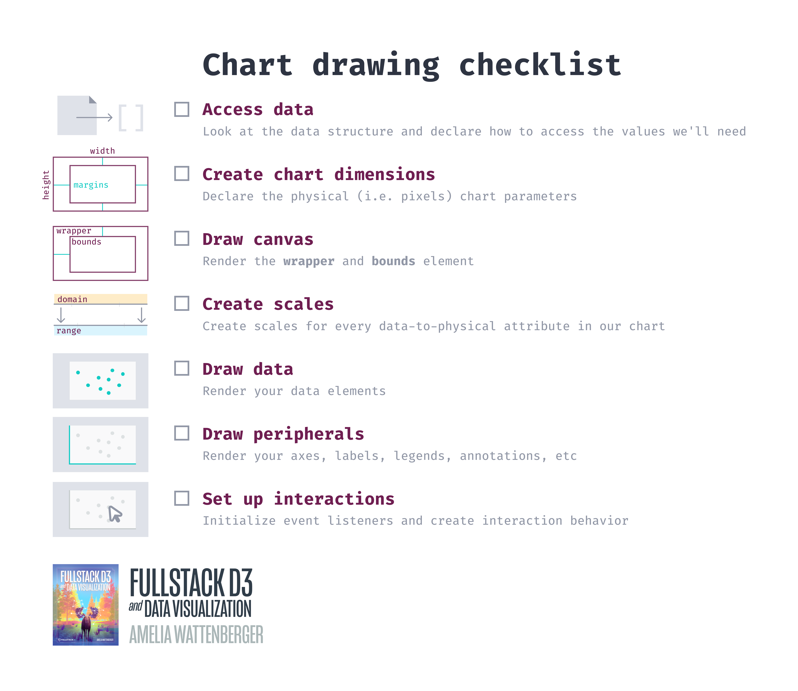
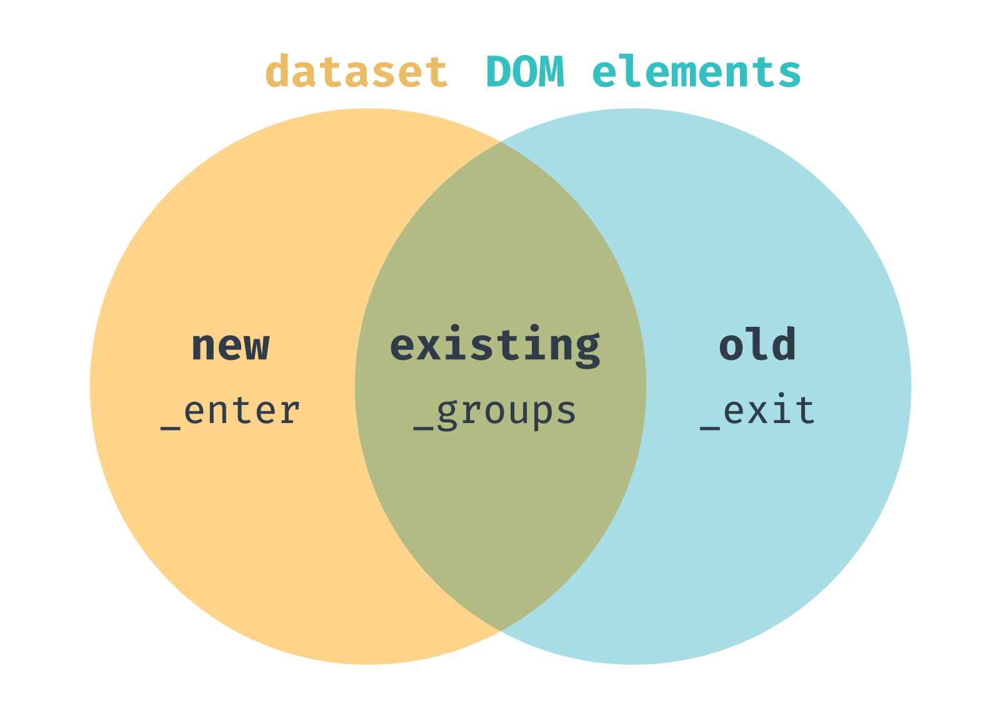

# Topics we covered

## Web development

- **HTML** (`.html`) files define the structure of the page _on page load_
- **CSS** (`.css`) files update the style of the page
- **Javascript** (`.js`) files add interaction and change the structure of the page _after page load_

When our browser loads a page, it will load the HTML content (often `index.html`). It will then apply the linked CSS styles and run the linked Javascript scripts.

We like to write our chart-creating code in Javascript because it can handle the calculations for us (eg. using a scale to turn temperature values into pixel values).

- **SVG** (Scalable Vector Graphics) content is similar to HTML, but has its own elements and has different positioning rules

Drawing charts is easier in SVG because it has basic shapes, and a coordinate system

We've used a few SVG elements:
- shapes, like `circle`, `line`, `rect`, `text`
- containers, like `g`

Each element has its own set of attributes used to position it. Here's a cheat-sheet we can use to remind ourselves of what they are:


To style SVG elements, we use `fill` & `stroke` - either as attributes (set using `.attr()`) or CSS styles (set using `.style()`).

## Drawing charts

There are 7 basic steps when creating a chart:




### 1. Access our data
   - use `d3.json()` to fetch and parse our data
   - look at our data using `console.log(data)`
   - create **accessor functions** to use later
     - these **accessor functions** will take a data point (one item in the `data` array) and return a value in the data domain (eg. temperature)

### 2. Create chart dimensions
   - define `dimensions` of **wrapper** & **margins**
     - the **wrapper** contains the _entire_ chart
     - the **bounds** contains our x & y scales
     - 
   - subtract **margins** to define the size of our **bounds**

### 3. Draw canvas
   - we update the DOM (webpage structure) by using **d3 selections**
   - to start, we hook onto an existing HTML element (eg. `#wrapper`)
   - create our `wrapper` element
   - create our `bounds` element

### 4. Create scales
   - create scales for each physical dimension
     - a scale converts values from the data domain to the physical domain, so we can visualize the data
   - set the `domain` (input) for each scale
   - set the `range` (output) for each scale
   - - 

### 5. Draw data
   - use a **data join** (`.join()`), if we have a one-to-one mapping of items in an array <-> svg elements
   - we can update only entering elements, updating elements, and/or exiting elements (in that order) by using individual update functions within `.join()`
   - 

### 6. Draw peripherals
   - draw axes, labels, legends, annotations, etc
   - `xAxis.call(xAxisGenerator)` is the same as `xAxisGenerator(xAxis)`

### 7. Set up interactions
   - use `selection.on(eventName, function)` to run a function when a specific event happens

## Transitions & Animations

We can animate any update by adding `.transition()` right beforehand. For example:

```
dots.transition()
  .attr("r", 10)
```

We can customize our transitions a few ways:

- `.duration()` (in milliseconds)
- `.delay()` (in milliseconds)
- `.ease()` ([options](https://github.com/d3/d3-ease))

## Interactions

There are many events that could trigger a change to a chart.

- mouse enter, mouse leave
- click
- key press
- page scroll
- page resize
- touchpad zoom
- etc.

To add a trigger, we can use the `.on()` method of a **d3 selection**. `.on()` takes two parameters:

- the type of event (`string`)
- the `function` to run on trigger

## Updating our chart

If we want to re-draw our chart (say, if we update the data or resize the browser), we'll want to put most of our chart drawing steps (probably #2 - #6) inside a repeatable function.

We don't want to create any one-off elements inside this function, so we'll make a `selectOrCreate` function to use. This will check whether or not an element already exists, create it (if needed), and return a **d3 selection**.

```js
const selectOrCreate = (elementType, className, parent) => {
  parent = parent || wrapper
  const selection = parent.select("." + className)
  if (!selection.empty()) return selection
  return parent.append(elementType)
      .attr("class", className)
}
```