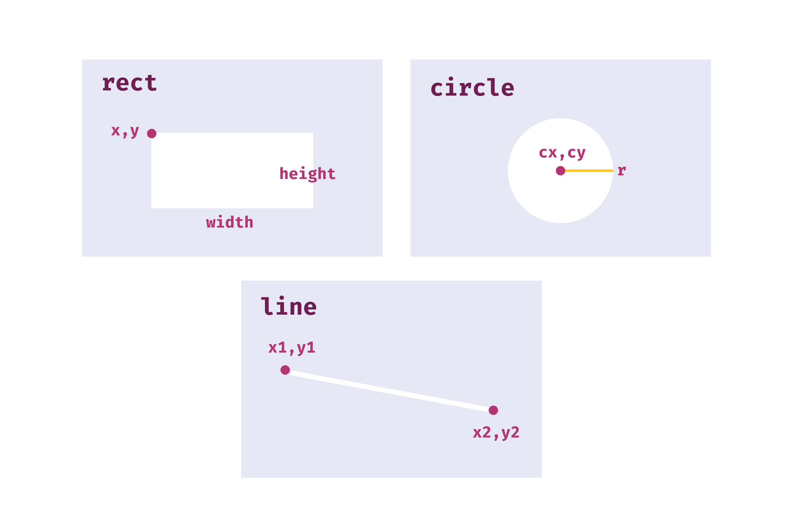
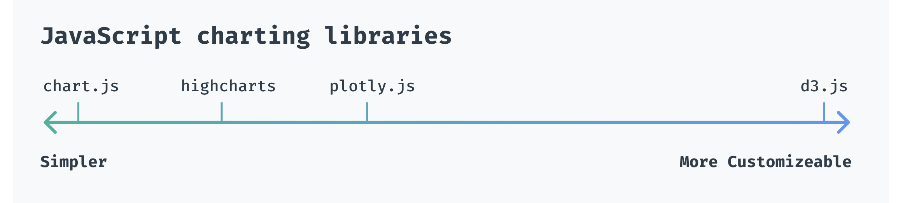
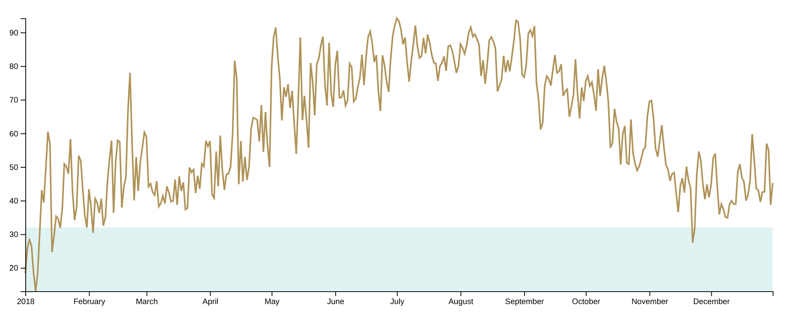
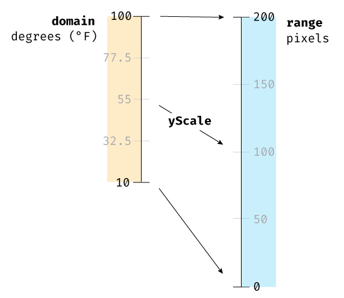

# Week 1

---

- **INTRO**: ~15 min
- **PART I: drawing in the browser**
  - 25 min walk-through, 10 min exercise, 10 min share, 5 min break
- **PART II: create our first chart**
  - 1 hour 20 min walk-through, 10 min exercise
- **WRAP UP**: ~5 min

---

- **INTRO**
  - introduce ourselves
  - what are we learning in this workshop?
  - what are the advantages of visualizing data in the browser?
    - easy to access
    - interactive
    - very customizable
  - set everyone up with a code sandbox

- **PART I**
  - 25 min walk-through, 10 min exercise, 10 min share, 5 min break
  - CodeSandbox basics
    - fork the repo:
      - https://codesandbox.io/s/d3-workshop-mnn9f?file=/index.html

  - web development basics
    - HTML
      - https://developer.mozilla.org/en-US/docs/Learn/Getting_started_with_the_web/HTML_basics
  - go over svg vs html
    - raster vs svg
      - example: https://wattenberger.com/blog/svg#1
    - svg
      - width, height
    - rect
      - x, y, width, height
    - circle
      - r, cx, cy
    - line
      - x1, x2, y1, y2
    - 
    - fill, stroke
      - colors: https://en.wikipedia.org/wiki/Web_colors#Extended_colors
    - 
    - **EXERCISE**: get used to CodeSandbox & draw a train
    - **SHARE**: save your work & share your link
      - questions about svg or CodeSandbox?
      - anything confusing about svg?
      - what other shapes did you want to use?

- **PART II**:
  - 25 min walk-through, 10 min exercise, 10 min share, 5 min break
  - move over to javascript
    - talk about why we'll change the page using javascript instead
    - what is d3.js?
      - 
      - show https://wattenberger.com/blog/d3
  - let's draw a timeline
    - access our data
    - look at our data
      - data documentation:
        - https://darksky.net/dev/docs#data-point-object
    - to start, we'll make a timeline of max temperature per day
    - 
    - create accessor functions
    - talk about wrapper & bounds
      - 
    - create dimensions
    - draw wrapper & bounds
      - d3 selection objects
      - 
    - create scales (x & y)
    - 
    - draw data! (d3.line)
      - path d attribute
        - 
      - generator functions
    - draw axes

- **WRAP UP**
  - recap:
    - svg basic shapes
    - wrapper & bounds
    - chart checklist
    - using d3 to make our lives easier
      - creating path d attributes
      - joining DOM elements with data
  - next week: scatter plots, data-binding, & animations

---

# Homework

re-create our timeline
  - fork [our template](https://codesandbox.io/s/d3-workshop-mnn9f?file=/index.html)
  - grab your [weather data](https://drive.google.com/drive/folders/1I5qRszQf7jGmEx5GaX1sinC0OrvkBZko)

  - work as much from memory as possible
  - check the finished code we created on Thursday if you need a hint:
  [finished code](https://codesandbox.io/s/d3-workshop-timeline-3fk7g)

  - send me questions or your CodeSandbox link if you run into questions or issues: wattenberger@gmail.com

  - *if you want more of a challenge after you finish*
    - switch to a different metric
    - draw a rectangle behind your birthday
    - how would you switch to an area chart?
      - hint: https://github.com/d3/d3-shape#area
