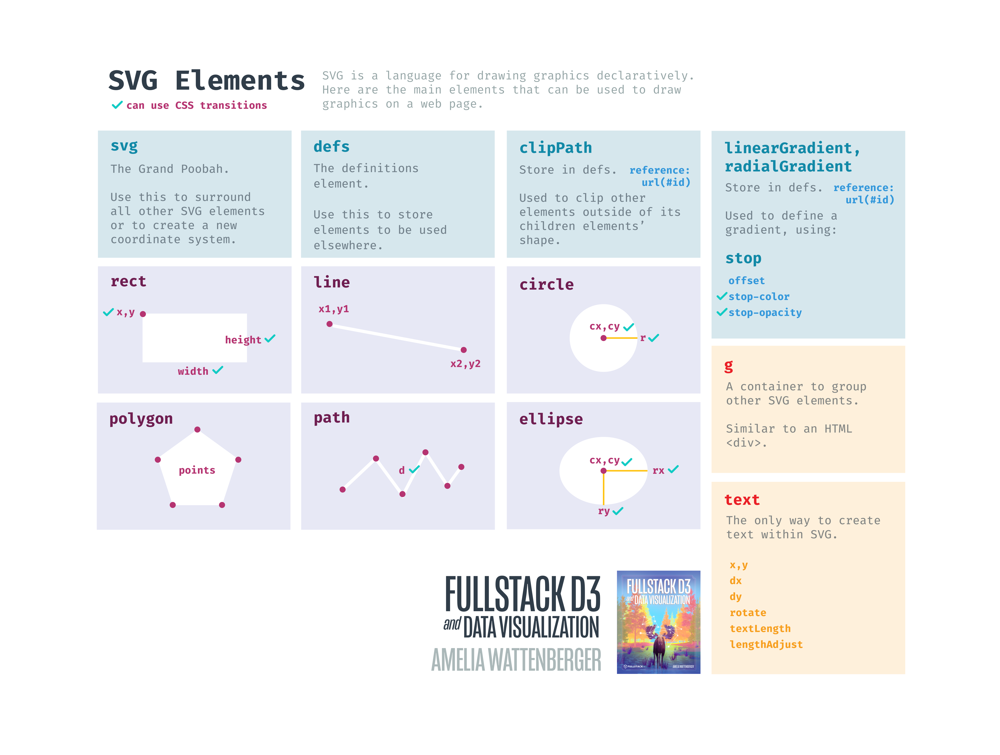

# Week 1

- **INTRO**: ~15 min
- **PART I**:
  - 25 min walk-through, 10 min exercise, 10 min share, 5 min break
- **PART II**:
  - 25 min walk-through, 10 min exercise, 10 min share, 5 min break
- **PART III**:
  - 25 min walk-through, 10 min exercise, 10 min share, 5 min break
- **WRAP UP**: ~5 min
- **go over HOMEWORK**: ~5 min

---

- **INTRO**
  - introduce ourselves
  - set everyone up with a code sandbox

- **PART I**
  - 25 min walk-through, 10 min exercise, 10 min share, 5 min break
  - CodeSandbox basics
    - fork the repo:
      - https://codesandbox.io/s/d3-workshop-mnn9f?file=/index.html

  - web development basics
    - HTML
  - go over svg vs html
    - raster vs svg
      - example: https://wattenberger.com/blog/svg#1
    - svg
      - width, height
    - rect
      - x, y, width, height
    - circle
      - r, cx, cy
    - line
      - x1, x2, y1, y2
    - 
    - fill, stroke
      - colors: https://en.wikipedia.org/wiki/Web_colors#Extended_colors
    - 
    - **EXERCISE**: get used to CodeSandbox & draw a train
    - **SHARE**: save your work & share your link
      - questions about svg or CodeSandbox?
      - anything confusing about svg?
      - what other shapes did you want to use?

- **PART II**:
  - 25 min walk-through, 10 min exercise, 10 min share, 5 min break
  - move over to javascript
    - talk about why we'll change the page using javascript instead
    - what is d3.js?
      - show https://wattenberger.com/blog/d3
  - let's draw a timeline
    - access our data
    - look at our data
      - data documentation:
        - https://darksky.net/dev/docs#data-point-object
    - to start, we'll make a timeline of max temperature per day
    - 
    - create accessor functions
    - talk about wrapper & bounds
      - 
    - create dimensions
    - draw wrapper & bounds
    - create scales (x & y)
    - 
    - draw data! (d3.line)
    - draw axes
    - **EXERCISE**: re-create the chart yourself
      - grab your weather data
        - https://drive.google.com/drive/folders/1I5qRszQf7jGmEx5GaX1sinC0OrvkBZko
        - download,
      - as much from memory as possible
      - *if you finish early*
        - switch to a different metric
        - draw a rectangle behind your birthday
        - how would you switch to an area chart?
          - hint: https://github.com/d3/d3-shape#area
    - **SHARE**: save your work & share your link
      - what was hard or confusing?
      - which parts did you need to look up?

- **PART III**
  - 25 min walk-through, 10 min exercise, 10 min share, 5 min break
  - let's draw a scatterplot
    - re-fork the template:
      - https://codesandbox.io/s/d3-workshop-mnn9f?file=/index.html
    - go over checklist
      - 
    - start from the top:
      - access data
      - create dimensions
      - draw canvas
      - create scales
        - .nice()
        - 
      - draw data
        - data join
        - 
      - draw peripherals
        - axis labels
      - **EXERCISE**: re-create the chart yourself
        - *if you finish early*
          - add another metric:
            - temperature as the circle radius
            - wind speed as the circle color
      - **SHARE**: save your work & share your link
        - were some part easier this second time?

- **WRAP UP**
  - recap:
    - svg basic shapes
    - wrapper & bounds
    - chart checklist
    - using d3 to make our lives easier
      - creating path d attributes
      - joining DOM elements with data
  - next week: animations & interacting with our charts

- **HOMEWORK**
  - create a bar chart
  - *without* looking up examples
