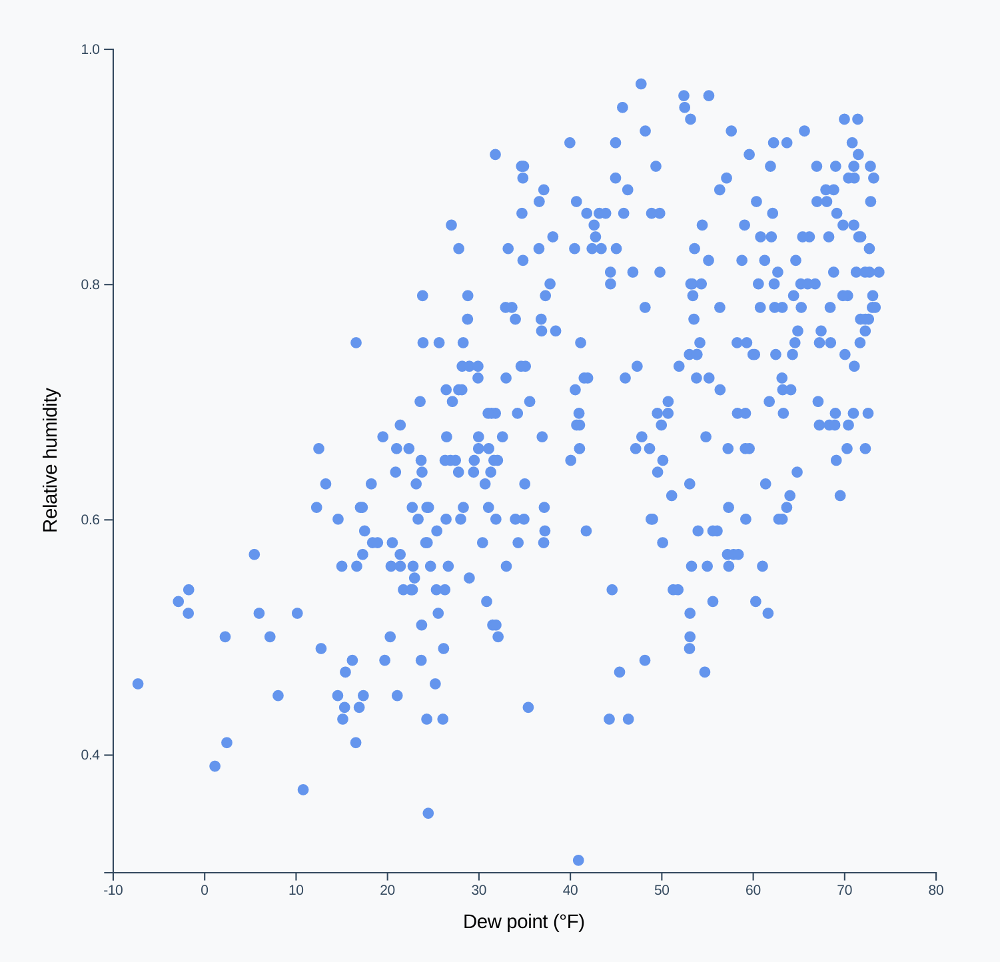

# Week 2

Today, we'll be solidifying our foundation of how to make charts, while also learning how to add transitions and animations

---

- **INTRO**: ~30 min
- **PART I: drawing a scatter plot**
  - 30 min walk-through, 10 min exercise, 10 min share, 5 min break
- **PART II: animating changes**
  - 15 min walk-through, 10 min exercise, 10 min share, 5 min break
- **PART III: animating changes in our chart**
  - 20 min walk-through, 10 min exercise
- **WRAP UP**: ~5 min

---

- **INTRO**
  - **SHARE**: save your work & share the link of your timeline
    - how did the exercise go?
    - questions:
      - what was the most challenging part?
      - any lingering questions that we can clear up, or concepts that could use another explanation?
      - what went well?
    - let's go over the extra credit bit:
      - draw a rectangle behind your birthday

- **PART I**
  - 30 min walk-through, 10 min exercise, 10 min share
  - let's draw a scatterplot
      - 
    - fork the timeline:
      - https://codesandbox.io/s/d3-workshop-timeline-3fk7g
    - go over each step
      - 
      - switch to square chart
      - drawing dots with a for loop
      - data join
        - 
      - add axis labels
      - **EXERCISE**: change your timeline into a scatter plot
        - *if you finish early*
          - change the metric:
            - use temperatureMax as the circle radius
            - use windSpeed as the circle color
      - **SHARE**: save your work & share your link

- **PART II: animating changes**
  - 15 min walk-through, 10 min exercise, 10 min share, 5 min break
  - let's fork a new sandbox
  - transition, duration
  - delay, [easing](https://github.com/d3/d3-ease)
  - **EXERCISE**:
    - three exercises: https://codesandbox.io/s/d3-workshop-animation-exercise-lhvtc?file=/index.js

- **PART III: animating changes in our chart**
  - 30 min walk-through, 10 min exercise
  - why would we want to animate changes?
  - let's animate our circles!
    - isolate into a function we can call with different data
    - chunk and `setTimeout` between draws
    - transitioning updates
    - separate enter, update, exit transitions
    - using a key to tell d3 what data points are the same

- **WRAP UP**: ~5 min

- **HOMEWORK**
  - play around with the onEnter, onUpdate, and onExit transitions to get a feel for them
    - [our sandbox](https://codesandbox.io/s/d3-workshop-animated-scatter-plot-xp1jc?file=/index.js)
    - extra credit:
      - have the circles draw in one at a time
      - switch to rectangles instead of circles
