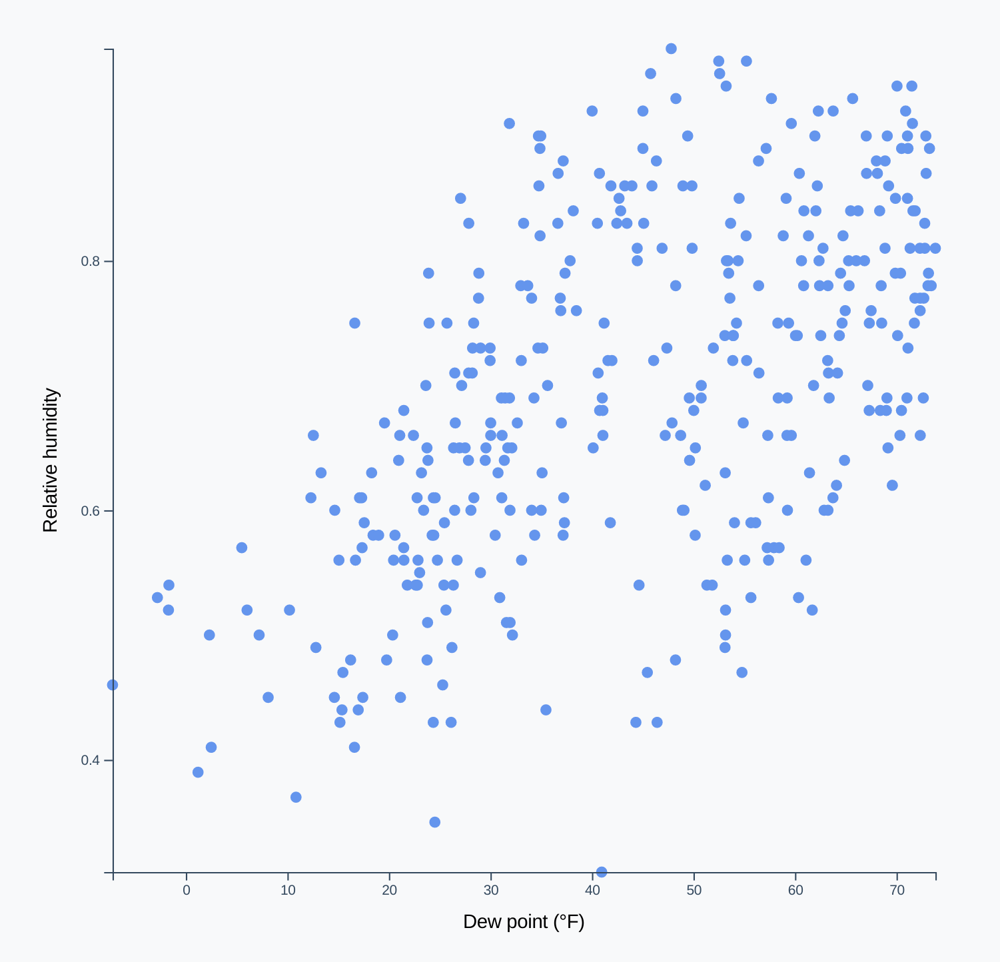

# Week 2

- animations & transitions
- interactions

- **SHARE**: save your work & share the link of your timeline
  - what was hard or confusing?
  - which parts did you need to check?

- **PART I**
  - 25 min walk-through, 10 min exercise, 10 min share
  - let's draw a scatterplot
      - 
    - re-fork the template:
      - https://codesandbox.io/s/d3-workshop-mnn9f?file=/index.html
    - go over checklist
      - 
    - start from the top:
      - access data
      - create dimensions
        - make a square chart
        - d3.min
      - draw canvas
      - create scales
        - .nice()
        - 
      - draw data
        - data join
        - 
        - .join()
      - draw peripherals
        - axis labels
      - **EXERCISE**: re-create the chart yourself
        - *if you finish early*
          - add another metric:
            - temperature as the circle radius
            - wind speed as the circle color
      - **SHARE**: save your work & share your link
        - were some part easier this second time?
