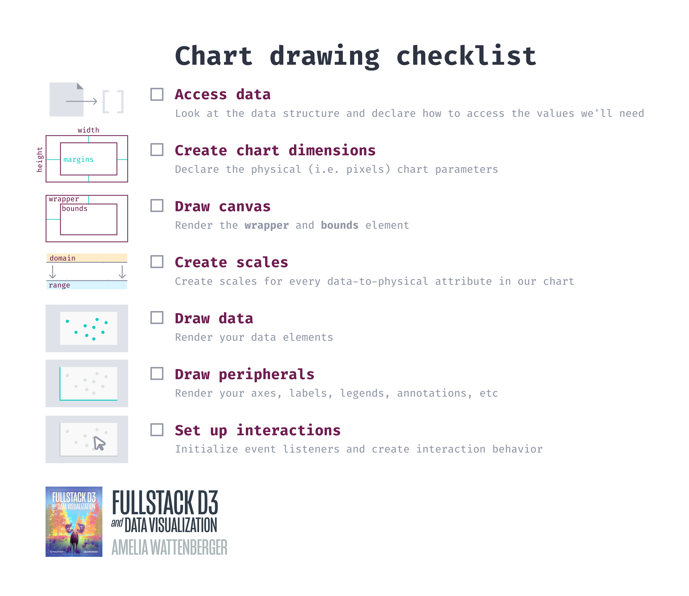

# Week 3

Today, we'll be solidifying our foundation of animations, and learning about making our charts interactive! Sadly, this is our last session, but I'll leave 20 minutes at the end for Q & A.

---

- **INTRO**: ~30 min
- **PART I: events in the browser**
  - 30 min walk-through, 10 min exercise, 10 min share, 5 min break
- **PART II: adding a tooltip**
  - 30 min walk-through, 10 min exercise, 10 min share, 5 min break
- **PART III: (if we have the time) adding a date filter**
  - 20 min walk-through, 10 min exercise
- **WRAP UP**: ~5 min
- **Q & A**: 20 min

---

- **INTRO**
  - **SHARE**: save your work & share the link of your scatter plot (totally optional!)
    - how did the exercise go?
    - questions:
      - what parts were confusing?
      - any lingering questions that we can clear up, or concepts that could use another explanation?
      - what went well?

- **PART I: events in the browser**
  - 30 min walk-through, 10 min exercise, 10 min share
    - [base sandbox](https://codesandbox.io/s/d3-workshop-scatterplot-qqvdx)
    - small tangent 1: concurrent transitions
      - https://codesandbox.io/s/d3-workshop-animation-exercise-concurrent-answer-c10j6?file=/index.js:1077-1482
    - small tangent 2: I added labels
      - text-anchor
      - transform: rotate
    - what events are available in a browser?
      - https://wattenberger.com/blog/d3-interactive-charts
    - d3 selection .on() [docs](https://github.com/d3/d3-selection/#selection_on)
    - let's resize our chart on window resize
      - adding an event listener
      - turning our code into a repeatable function
        - put a check next to each step that we need to run again, after the window is resized
        - 
        - selectOrCreate function
        
```js
const selectOrCreate = (elementType, className, parent) => {
  const selection = parent.select("." + className)
  if (!selection.empty()) return selection
  return parent.append(elementType)
      .attr("class", className)
}
```

**EXERCISE**
- re-create this with a forked scatterplot
  - [base sandbox](https://codesandbox.io/s/d3-workshop-scatterplot-qqvdx)
  - extra credit:
    - can you animate this change?
    - how can you use the .ticks() function to make sure the ticks don't get too crowded?
      - hint: `xAxisGenerator.ticks(5)` aims for 5 ticks
    - how can you shrink the dots to shrink with the window size?
    - 10 minute share
    - 5 minute break
- **PART II: adding a tooltip**
  - 30 min walk-through, 10 min exercise, 10 min share
    - [base sandbox](https://codesandbox.io/s/d3-workshop-scatterplot-qqvdx)
    - creating the tooltip
    - there are a lot of needed styles - put them in their own .css file
    - .on("mouseenter")
      - function parameters: event, d
    - position & change the text
    - hide when you leave the wrapper
    - note: there's another method of doing tooltips in the book (using voronoi) that feels a bit smoother
  - **EXERCISE**
    - re-create on your scatterplot
      - [base sandbox, if needed](https://codesandbox.io/s/d3-workshop-scatterplot-qqvdx)
      - extra credit:
        - change the color of the hovered dot
          - hint: it might be easier to create a new dot and hide/show/move it around
- **PART III: (if we have the time) adding a date filter**
  - what are some ways users can interact with a chart
    - some examples: https://loa.mit.edu/#/Database
    - wackier examples: https://wattenberger.com/wdvp
  - create a slider that sits across the top of the chart, with a text element showing the hovered date
  - create an `.on("mousemove")` event
  - get the x position, then invert it to get the date
  - you'll need this:
```js
const getNumberOfDaysAway = (date1, date2) => {
  const dates = [date1, date2].sort((a,b) => a - b)
  return d3.timeDays(...dates).length
}
```
  - set the dots' opacity based on how far away they are from that date
  - add a mouseleave event

<!-- - **PART II: changing the metric**
  - 30 min walk-through, 10 min exercise, 10 min share
    - let's add dropdown to select which metrics we're looking at
    - populating our selects
    - generalizing our accessor functions
    - turning our chart code into a repeatable "update" function
    - transition our axes -->

- **WRAP UP**: ~5 min
  - quick run through of [recap doc](./../recap.md)
- **Q & A**: 20 min
  - questions about what we've covered so far
  - questions about d3.js / data visualization in the browser
  - questions about web development in general
